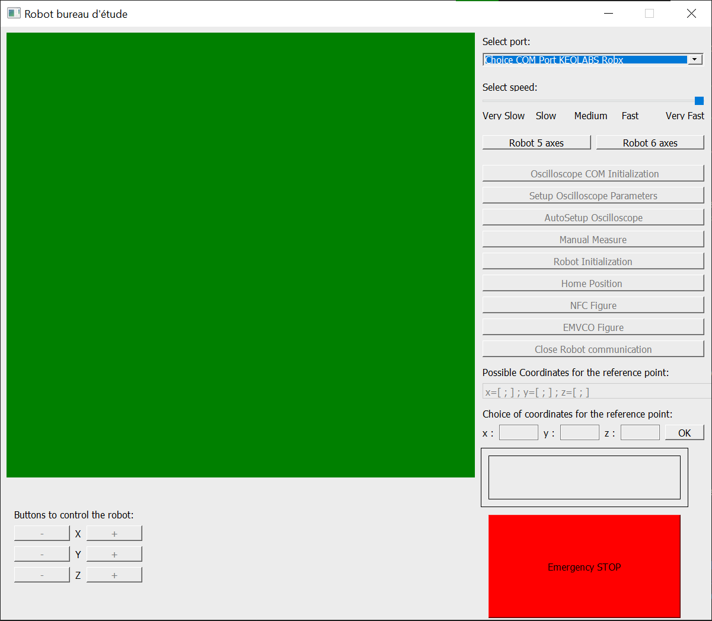

    # Outil pour piloter les bras robot

    ## Crédits
    développé par :
    - Lisa Duterte, Romain Derrien, Clement Rouvier et Elsa Della Valle (BE 22-23)
    - Hamid AJOUAOU, Roméo BOTULI-BUNDOL, Samuel DECAY et baptiste Saby (BE 23-24)

    ## Instalation
    L'outil requiert :
    - python 3.10 (développé sous 3.10.11)
    - les packages :
        - PyQt5
        - pyserial
        - PyVISA
        - pywin32
    - les logiciels :
        - RobX_1.28.20.1027.exe (logiciel de keolabs pour les librairies)
        - activedsoinstaller.exe
        - IviSharedComponents_300.exe
        - lecroyscope.3.2.9.0-x64.msi
        visa530runtime.exe
        wavestudioinstaller64_8.7.0.5.exe
        pour le 5 axes (driver serial):
            - UC232A_Windows_Setup.exe
        pour le 6 axes (logiciels de denso pour controller leur robot, requiert une license):
            - WINCAPS III v3.64.2 ou ultérieur
            - ORiN2 (s'installe automatiquement lors de l'installation de wincaps III)
            De plus, l'outil requiert une ip statique sur le port du PC.
            Pour cela :
                - chercher "panneau de controle" dans windows
                - aller dans "réseau et internet"
                - "Réseau et centre de partage"
                - "changer les option d'adaptateur"
                - faire clique droit sur "Ethernet"
                - cliquer sur "propriétés"
                - cliquer sur "Protocol Internet Version 4 (TCP/IPv4)"
                - cliquer sur "propriétés"
                - selectionner "utiliser l'addresse ip suivante"
                - entrer "192.168.30.33" dans le champ "addresse ip" et "255.255.255.0" dans le champ "masque sous réseau"

    ## Utilisation 
    Pour le robot DENSO 6 axes spécificquement, veuillez lancer wincaps III et se log en mode développer au préalable
    Pour utiliser l'outil :
    - brancher le robot allumé et l'oscilloscpe à l'ordinateur
    - lancer le script MainWindow.py (se déplacer dans le dossier et faire ./MainWindow.py)  

    - dans le cas du 5 axes :
        - ouvrir le menu déroulant et selectionner le port comm correspondant au robot
        - cliquer sur 5 axes
    - dans le cas du 6 axes, cliquer sur 6 axes

    - initialiser l'oscilloscope avec les boutons "Oscilloscope COM Initialization" et "Setup Oscilloscope Parameters"

    - initialiser le robot avec le bouton "Robot Initialisation"
	
	- le scale doit être réglé sur l'oscilloscope

    

    Le robot DENSO est pilotable manuellement via le logiciel de keolabs, pour l'utiliser, ouvrir un invite de commande dans le dossier "C:/Program Files(x86)/KEOLABS/RobX/Bin" et entrer la commande "Rob6xManager P S192.168.30.34 DENSO VS-AV6"

    ## Axes de développement
    - ajouter une fonction qui prendrait 3 points (définisant un pavé) et 3 instervales (pour avoir le nombre de points par rangées) pour définir un set de points 
        - par exemple, ((0, 0, 0), (10, 10, 0), (0, 0, 10), 1, 1, 1) définierait un cube de 10cm sur chaque axe avec un point de mesure tout les cm.
    - nettoyer le code de main window
    - implémenter un traitement des données collectées lors de l'aquisition